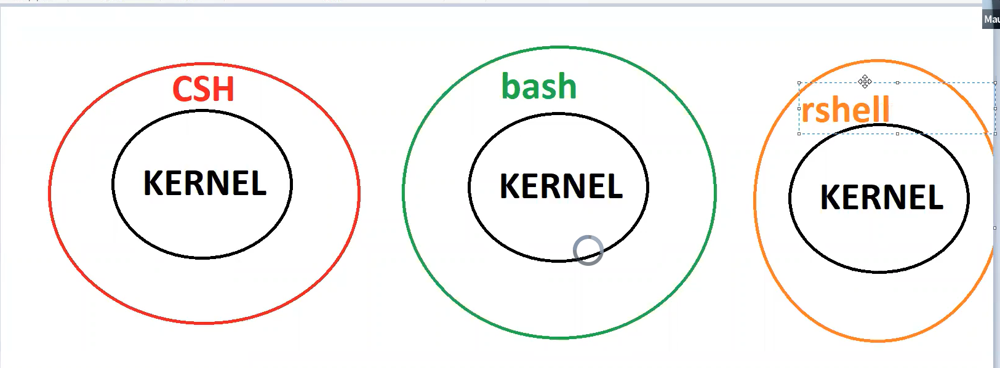

# 1. El poder del la linea de comandos de Linux.
# 1.2 Archivo / fichero
* Documento de determinado extesion y que se puede modificar o trabajar.
# 1. 3 Archivar
* La tecnica por la cual se comprime o se guarda el archivo  o se archican  y se guardan en algun lugar del sistema.
*  Se pueden guardar por un tema de backup
* Linux provee de diferenetes herramientas para `comprimir` archivos y empaquetar archivos con la finalidad de optimizar el espacio en el disco de almacenamiento.
* `archivar files tar`: se hace con herramientas de compresion `gzip, .bzip, xz`.
* `tar -cf <file>`: Comando mas anitiguo de linux para comprimir archivos
```bash
    #Crear un archiv comprimido
    tar -cf ejemplo.tar archivo1.txt archivo2.txt
    # extraer-descomprimir en el archivo actual un file tipo tar
    tar -xf ejemplo.tar 
    # mostrar el contenido comprimido del archivo
    tar -tvf ejemplo.tar
    # tipos de formatear

```
* `GNU Zip or gunzip(.gzip)`: Este es una herramienta util de Linux con el cual podemos comprimir `zippear` o descomprimir archivos en el `bash` tranquilamente y comodamente

* `-J(xz)`: es el formato que es mas recomendado y el mejor para `zippear` archivos, estos son tipos o `formatos de zippeo`.
* 
* `ls -lh`: Permite listar el directorio pero en `kilobytes` de almacenamiento.
* `du -hsc <directory_or_file_name>*`: (* todos) permite mostrar el tamanio o el peso del directorio

* `tar -cf <file_zip_name> <directory_name_to_zip>`: Forma como hacer un `zippero` en linux

* Cuando se usa el factor de compresion `xz` existe un `delay` mucho mayor debido a que el factor de  compresion es mayor

```bash
    # empaquetar el directorio
    tar -cf Documentos1.tar Documentos

    # Esto nos sirve para ver (view) el proceso 
    #que sige la herramienta para empaquetar el directorio
    tar -cvf Documentos2.tar Documentos

    # como `zippear ` un directorio por un determinado factor de compresion en  este caso el  formato .bzip2
    tar -cjvf Documentos2.tar.bzip2 Documentos
    # comprimiendo con formato `xz`
    tar -cJvf Documentos2.tar.xz Documentos
    # comprimiendo archivos con formato gzip
    tar 

    # Ahora para extrear o `descomprimir` el archivo samos
    tar -xvf Documentos1.tar # Esto descomprime el archivo `Decumentos.tar` (x) de extract. Lo extrae en el mismo directorio y con el mismo nombre.

    # Comprimir cada archivo del directorio selecionado y agregandole `gz`, es decir cada archivo se reduce de tamanio.
    gzip -r Documentos # compresion

    # Descompresion de directorio que se comprimio.
    gunzip -r Documentos # descompresion

    # Manatiene el archivo original y hace una copia de los mismos archivos del directorio pero comprimido, es decir una copia y otra compia comprimida
    gzip -kr Documentos

    # Comprimir el archivo con formato `bzip2`. Ojo el archivo
    bzip2 carta1.txt
    
    # Descomprimir el archivo con el formato `bzip2`
    bunzip2 carta1.txt.bz2

    # comprimiendo con el formato `xz`
    xz carta2.txt

    # descomprimir el archivo con el formato `xz`
    unzx carta2.txt.xz

```
# 1.4 Busquedas en Linux
* Comandos utiles de Linux para reaalizar busquedas de archivos.
`find`: comando para buscar archivos
```bash
    # buscar un archivo en el directorio raiz con las iniciales del nombre o que contenga a dichos esos caracteres
    find / -name pass*

    # afinando al busqueda en carpetas con privilegios de administrador en la carpeta `etc`.
    sudo find /etc -name pass* 

    # busqueda del archivo index.html en la carpeta `/etc/``
    find /etc -name index.html

    # grep: imprime las lineas en los que existe coincidencia con la palabra `root` en la carpera `/etc/passw`.
    grep root /etc/passw

    # Listado de todos los archivo que no tiene login
    grep nologin /etc/passw
    
    # buscar un nombre en esepcifico en un archivo
    grep nara frutas.txt

    # Para ver en que ruta esta un determinado programa
    whereis firefox

    # Esto nos sirve para saber cual es la ruta en el que se encuentra el  ejecutable del programa buscado.
    which firefox
    
```

# 2. Shell scripting

* Esta es la parte mas poderoza e importante que tiene el sistema Linux
* Este es un codigo informatico de codigo abierto diseniado pra ser ejecutado por el shell de Unix/Linux.
* Es un termino de UNIX para una interfaz entre el  usuario y un servicio del sistema operativo
* El `shell` es el lugar donde el usuario interactua con  los comando que proporciona el sistema `Linux`.
* `Kernel`: Es la zona interna del SO que necesita un shell para interactuar.



* La finalidda del `bash` scripting es `automatizar los procesos`.
* Hay dos principales `shells` en Linux
    * 1. `Bourne shell`: el indicador de este shell es `$` y sus derivados son :
        * El shell de POSIX conocido como `sh`
        * Korn Shell tambien conocida como `sh`
        * Bourne Again Shell tambien conocida como `bash` es el mas popular y ampliamente utilizado.
    * 2. `El shell C`: su indicador de este shell es `%`y se categoriza en: 
        * C shell tambien se conoce como `csh`
        * Tops C shell tambien se conoce como `tcsh`

* comando para poder escribir en el editor `vi` presionar `i`(insert).
*  Para entrar como `administrador` del sistema se tiene que usar el comando.

```bash
    $ sudo su
```
eg: 

```bash
    # 1. crear un file en el editor `vi`
    $ vi demo.sh
    # Abrimos el editor y digitamos `i` para poder editar

    (#!/bin/shell) -->  esta es la cabecera que siempre debe tener un script de bash.

    # 2. script de bash here: (nota: este script esta dentro del file 'demo1.sh')
    name = "John Doe"
    greeting = 'How are you'
    echo "Hey  hello $name, $greeting"
    # 3. para guardar presionar 'escape' + :wq + enter.

    # 4. Ejecutar el archivo `bash` en el terminal de la siguente manera
    $ bash demo1.sh # output: 'Hello World!'

    # 5. entrada ade usuraio
    # dentro del script
    echo "Whats your name ? "
    read name
    echo "Hello, nice to meet you $name".


```
* Editor por defecto de `shell` es `vi`

# 2. Loops en shell scripting

* Generalmente este tipo de control de flujo va a ser necesario para realizar procesos `automatizados`.

```bash
    # dentro del archivo que se esta programando
    # bucle `for`.

    for i in iterator 1 2 3 4 5
    do
        echo "# generado: $i"
        # crear directorios con nombre igual al iterador.
        mkdir $i # antes de que salte el error se va a crear un directorio 'iterator'.
    done
    
```

# NOTA: 
* El simbolo `$`: dependiendo del `bash` indica que eres el usuario
* El simbolo `#`: indica que tienes privilegios de administrador


* Linux me permite cambiar de un `shell` a otro