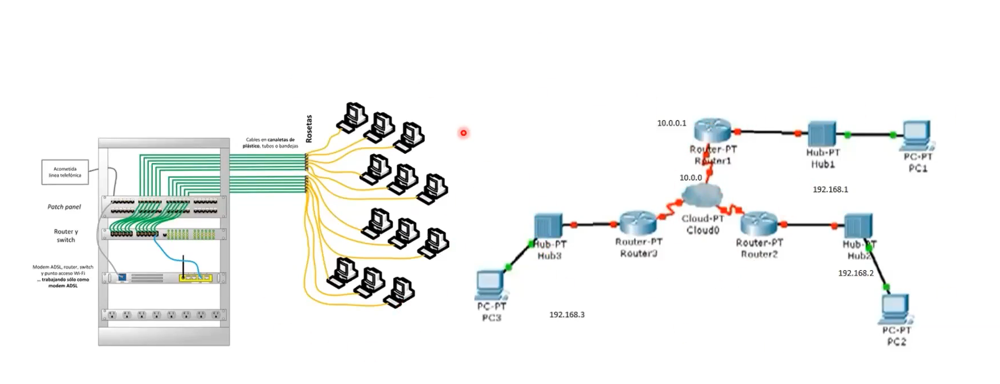
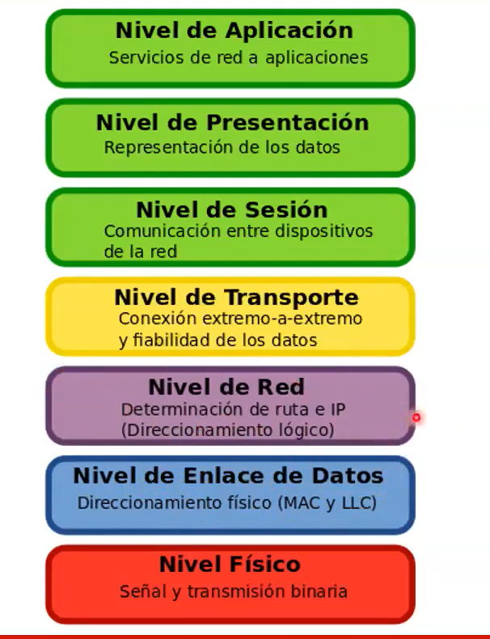
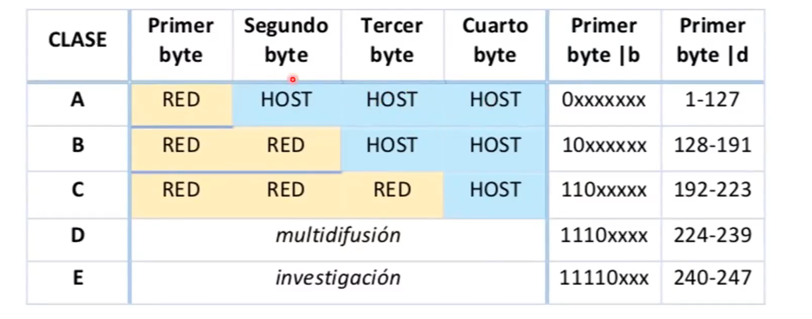
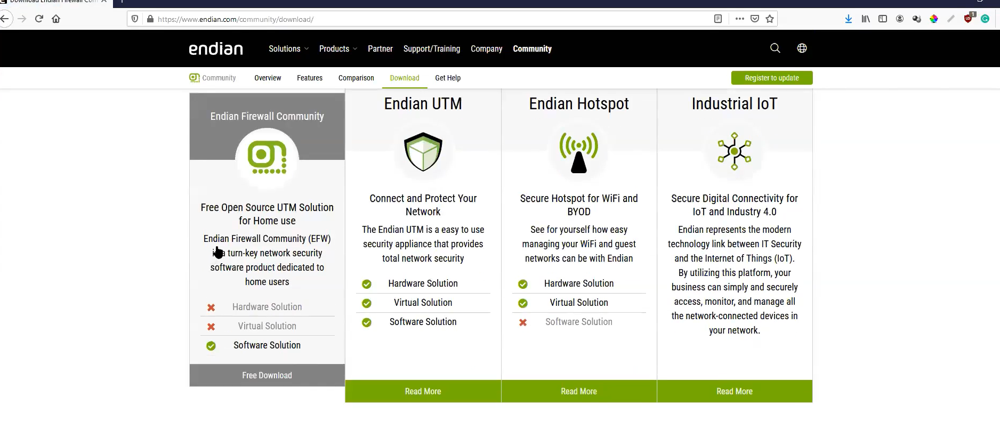
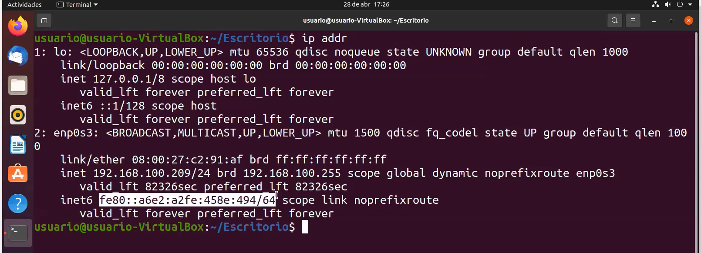

# 1. ? Que es un SO ?
* El `Sistema Operativo` es el corazon de su computadora y que permite que otras aplicaciones se ejecuten por medio de este
* Contiene controladores para acceder al `hardware` de la computadora, como discos y particiones del sistema
* Sistemas operativos basados en Linux
    * `Enterprise Linux`
    * `Consumer LInux`
* UNIX
* Mac OS X
* `SO embedidos`.
# 1.2 Sistemas Operativos
```bash
    # Verificacion de Kernel que se esta ejecutando en el sistema
    $ username -r
```

* `Unix`: Es un sistemas operativo altamente conocido y que ha sido el pilar para las  nuevas distribuciones de LINUX.
* `Mac OS`: Basado en la vertiende de BSD Linux.
* `Microsoft Windows`: Este es el SO mas usado por los usuarios en la actualidad.
* `Solaris`
* `HP-UX`
# 2. Elementos de Hadware

* `Fuentes de alimentacion`
* `Tarjeta Madre`: Main board: Es el circuito integrado que componene todos los elementos electronicos de la computadora.
* `Memoria`: Es el almacenamiento de la data que se usa para el procesamiento de la informacion.

```bash
    # comando para la gestion de memoria `-m`: megabytes
    $ free -m 
```
* Procesadores : Los procesadores son los encaragados de realizar las operaciones de computo.
* `GPU`  : Proecesador de video (Graphical Process Unit)
* `CPU`
    - *x64*: quiere decir que adminite intrucciones de 32 o 64 bits de la famila x82.
* Cache: Es una memoria de alamacenamiento temporal en que guardan las datos `recurrentes` para que el SO puede leerlos facilmente y rapidamente.
    - *Se encuentra integrada en el mismo procesador.*
* Cores: Se refiere  a un CPU individual, ademas el nucle representa una CPU `fisica`.
    - La HTT permite que una sola CPU fisica procese simultaneamente multiples intrucciones actuando virtualmente como multiples CPU fisicas.

* Almacenamiento
* `Procesadores - Cores`
- El pprocesador es el encargado de realizar los calculos
- Los `cores` son los aquellos modulos del procesador que se encarga de realizar los procesos y aligerar la carga al procesado. Son los procesadore logicos y que se encargan de realizar los procesos de SO en paralelo.

# 3. Sesion de practicas
```bash
    # Listar los componentes del SO
    $ lscpu 

    # Gestion de memoria en Linux
    $ lsblk

    #Informacion de memoria que esta disponible 
    $ lsblk -f
    # primero hacerse administrador del sistema
    $ sudo su

    # Gestionar la memoria en megasbytes o gigabytes
    $ free -m | -g

    # Mostrar detalladamente la informacion del procesador de sistema
    $ lscpu

    # Informacion del almacenamiento
    $ lsblk

    # Listar la informacion mas detallada del sistema de almacenamiento
    $ lsblk -f    
    

    
    
    

```
## 3.1 Comandos para buscar cosas importantes en el sitemas
* Archivos ejecutables en window son llamados `ejecutaables` en linux lo llamamos `binarios`.
```bash
    # Encontrar todos archivos `binarios` en linux o que son importantes para el sistema
    $ cd ./sbin

    # comandos mas usados estan en `/bin`. Este es el dirictorio de comandos mas usados.
    # Si los comandos no estan almacenados en `/bin` estaran en la  carpeta `./usr/bin`.
    $ cd ./bin
    $ cd ./usr/bin

    # Comando para encontrar un binario
    $ which adduser
    $ which rm
    $ which lscpu

    # TRABAJAR CON EL DIRECCTORIO `etc`: este es el directorio donde inicialmente se podia almacenar informacion cualquier
    # pero actualmente cuenta con informacion importante o achivos importantes
    # importante: estar dentro de ./etc
    $ cat group
    $ cat hostname  
    $ cat hosts
    $ cat passwd
    
    # ARCHIVOS DE INICIALIZACION
    # Estos son scripts que se ejecutan cuando hay un inicios de sesion de los usuario
    $ cat  bash.bashrc

    # Listar el contenido de los dominios de las direcciones IP.
    $ cat  resolv.conf    # para salir press: quit
    $ nslookup # para lista y solicitar los IPs de un determinado dominio
    
    

    ## TRABAJAR CON INFORMACION EN LA CARPTETA ./home

    # listar todos los files de home/users
    $ cd ./home 
    $ cd ./home/users

    # Listar archivos con extension oculto
    $ ls -a # todos los archivos con un punto .file son archivos ocultos

    # Listar el contenido en el archivo .bash_history
    $ cat .bash_history

    # Listar el contenido de archivo .bash_logout
    $ cat .bash_logout
    
    # Al inspeccionar la carpeta  `/boot` esta carpeta contiene todos loscomandos para el inicio o el arranque del sistema.
    $ cd /boot

    # LIstar todos los procesos que se estan ejecutando en el sistema
    $ ps -ef
    # El proceso con el numero 1 es el nucleo, es el proceso que inicia todo. Inicia todo y es el que ejecuta el sistema operativo como tal


    # Para listar todos los procesos que complementan al nucle ver en la carpeta `boot` ref = /home/user/boot
    # Listar los direcctorios que estan relacionados como incia o como es el arranque el sistema operativo o son archivos de la configuracion del nucleo
    $ ls -a 

    # Comando para inspecccionar el nucleo del sistema, nota: -> en la carpte /boot
    $ uname -r | -a

    # VER O INPSECCIONAR LOS ARCHIVOS DEL PROPIO SISTEMA
    # En la carpeta /proc

    # Listar los datos del sismte en el file cpuinfo
    $ cat cpuinfo

    # Para ver el tipo de kernel en ejecucion y permisos
    $ cat cmdline

    # Para ver los diferentes procesos que se pueden correr en el sistema, podemos inspeccionar en la carpeta /proc
    # Cantidad minima de procesos que se pueden correr en el sistema
    $ cat /proc/sys/kernel/pid_max
    
    # Determina si el dispositivo permite la comunicacion a traves de internet con otros servidores de la red.
    $ cat /proc/sys/net/ipv4/ip_forward

    # Listar la cantidad de PROCESOS que se pueden correr en el sistema
    $ cat /proc/sys/kernel/pid_max # output: 10^6 es el numero max de procesos, si es sistema desborda esta cifra, el  computador se detiene.

    # APRENDER EL DIRECTORIO /dev (dispositivos).
    # En esta carpeta se encuentran la informacion de todos los dispositivos del sistema.
    $ cd /dev

    # Listar
    $ ls -l /dev/sd*

    # Listar los terminales de un sistema en el que puedo usar
    $ ls -l /dev/ttyu

```

## 3.2. La computadora en la Red


1. _Modelo OSI_


```bash
    # Para ver la capa de enlace 
    $ ipv4 show

    # Direcciones IPv4: Direcciones de 4 partes los cuales se convierten en secuencias binarias.
    192.168.1.1

```
2. _Partes de direcciones IPv4_


3. _Subredes IPv4_

__Estas son las redes que nos permiten controlar, ordenar y mantener segura la red aislada en una sola red.__

4. Que es el Broadcast

5. _Enrutamiento IPv4_

Se puede realizar varias aplicaciones de red con el sistema operativo `Linuxd`.
```bash
    $ ip route show

    $ sudo ip route add default via 102.168.0.1

    $ ip rout show

    # COMANDOS BASICOS DE RED EN LINUX

    # Listar la direccion IP
    $ ip adrr

    # Hacer ping a mi propio direccion IP
    $ ping -6 | -4 <my_direction_ip>
```
* __Herramienta de Firewall sugerido y gratuito para SO Linux__

* Interfaz que muestra la lista de IP.



* Almacenamiento con particiones: 

* si no se encuentran estas parpetas es posible que aalgunas distribuciones hayan migrado sus comandos en: 


* Nano es otro editos de archivos tal como los es `vi`.
```bash
    $ nano <file>
```